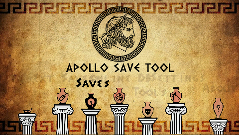

# Apollo Save Tool (PSP)

[![Downloads][img_downloads]][app_downloads] [![Release][img_latest]][app_latest] [![License][img_license]][app_license]

**Apollo Save Tool** is an application to manage save-game files on the PlayStation Portable.

This homebrew app allows you to download, unlock, patch, and resign save-game files directly on your PSP.

**Comments, ideas, suggestions?** You can [contact me](https://github.com/bucanero/) on [Twitter](https://twitter.com/dparrino) and on [my website](http://www.bucanero.com.ar/).

# Features

* **Easy to use:** no advanced setup needed.
* **Standalone:** no computer required, everything happens on the PSP.
* **Automatic settings:** auto-detection of User settings.

## Save Management

* **Save files listing:** quick access to all the save files on Memory Stick and the internal PSP memory (+ file details)
* **Save PARAM.SFO updating:** rehash, fix ownership, and update `PARAM.SFO` information when changing data files.
* **Save files patching:** complete support for Save Wizard and [Bruteforce Save Data](https://bruteforcesavedata.forumms.net/) cheat patches to enhance your save-games.
* **Save import/export:** allows the user to decrypt and export save files, and import decrypted saves from other consoles.
* **Save downloading:** easy access to an Online Database of save-game files to download straight to your PSP.

## PS1 Virtual Memory Card Management

* **VMC saves listing:** quick access to all save files on Virtual Memory Cards images.
  - Supported VMC formats: `.VMP`, `.MCR`, `.VM1`, `.BIN`, `.VMC`, `.GME`, `.VGS`, `.SRM`, `.MCD`
* **Import saves to VMC:** enables importing saves (`.MCS`, `.PSV`, `.PSX`, `.PS1`, `.MCB`, `.PDA` formats) to VMCs from other tools and consoles.
* **Export VMC saves:** allows the user to export saves on VMC images to `.MCS`/`.PSV`/`.PSX` formats.
* **Delete VMC saves:** remove any PS1 save file stored on VMC images.

# Download

Get the [latest version here][app_latest].

## Changelog

See the [latest changes here][changelog].

# Donations

My GitHub projects are open to a [sponsor program](https://patreon.com/dparrino). If you feel that my tools helped you in some way or you would like to support it, you can consider a [PayPal donation](https://www.paypal.me/bucanerodev).

# Setup instructions

No special setup is needed. Just follow these simple steps:
1. Download the latest [`apollo-psp.zip`](https://github.com/bucanero/apollo-psp/releases/latest/download/apollo-psp.zip) package 
2. Install it on your PlayStation Portable memory stick (`ms0:/PSP/GAME/APOLLO`)

On first run, the application will detect and setup the required user settings.

## Data folders

### PSP

| PSP | Folder |
|-----|--------|
| **External saves** | your saves must be stored on `<ms0/ef0>:/APOLLO/SAVEDATA/`. |
| **Memory Stick saves** | save-games will be scanned from `ms0:/PSP/SAVEDATA/`. |

### PS1

| PS1 | Folder |
|-----|--------|
| **External saves** | your saves must be stored on `<ms0/ef0>:/PS1/SAVEDATA/`. |
| **Exported PSV saves** | .PSV saves are saved to `<ms0/ef0>:/PS3/EXPORT/PSV/`. |
| **Virtual Memory Cards** | VMC images will be scanned from `<ms0/ef0>:/PS1/VMC/`. |

## PSP save-game Keys

**Note:** To decrypt PSP save files, game-specific save keys are required. You can dump the required keys using PSP plugins, such as:
- [SGKeyDumper](https://github.com/bucanero/psptools/releases/download/20220719/pspsgkey13.zip)
- [SGDeemer](https://github.com/bucanero/psptools/releases/download/20220719/SGDeemer111.rar)

1. Install the plugin on your PSP (`ms0:/seplugins`)
2. Enable it using the recovery menu. 
3. Start your PSP game and let it load/save so the plugin can dump the key.
4. Once the key has been dumped, Apollo will detect it, and use it as needed to decrypt, encrypt, apply patches, or rehash the PSP save.

**Tip:** if you have PSP save keys, use Apollo's `Dump Save-game Key` option on your PSP save, and then share the `gamekeys.txt` file so all these keys can be added to the next release.

# Usage

Using the application is simple and straight-forward: 

 - Move <kbd>UP</kbd>/<kbd>DOWN</kbd> to select the save-game file you want to patch, and press . The patch screen will show the available fixes for the file. Select the patches and click `Apply`.
 - To view the item's details, press .
It will open the context menu on the screen. Press  to return to the list.
 - To reload the list, press .
 - Press <kbd>L1</kbd>/<kbd>L2</kbd> or <kbd>R1</kbd>/<kbd>R2</kbd> trigger buttons to move pages up or down.

# Online Database

The application also provides direct access to the [Apollo online database](https://github.com/bucanero/apollo-saves) of save-game files for PlayStation Portable games.
These usually offer additional features such as completed games that can save you many hours of playing.

The Online Database project aims to [add more save-games](https://github.com/bucanero/apollo-saves/issues/new/choose) shared by the community.

**Note:** Downloaded save files **must be resigned** using Apollo before loading them in your games.

# FAQs

 1. Where I can get a save-game for *XYZ game*?
    
    You can check sites like [Brewology.com](https://ps3.brewology.com/gamesaves/savedgames.php?page=savedgames&system=psp), and [GameFAQs](https://gamefaqs.gamespot.com/psp/). Also, searching on [Google](http://www.google.com) might help.
 1. I have a save-game file that I want to share. How can I upload it?
    
    If you have a save file that is not currently available on the Online Database and want to share it, please check [this link](https://github.com/bucanero/apollo-saves) for instructions.
 1. Why is it called **Apollo**?
    
    [Apollo](https://en.wikipedia.org/wiki/Apollo) was the twin brother of [Artemis](https://en.wikipedia.org/wiki/Artemis), goddess of the hunt. Since this project was born using the [Artemis-GUI](https://github.com/Dnawrkshp/ArtemisPS3/) codebase, I decided to respect that heritage by calling it Apollo.

# Credits

* [Bucanero](http://www.bucanero.com.ar/): [Project developer](https://github.com/bucanero)

## Acknowledgments

* [Dnawrkshp](https://github.com/Dnawrkshp/): [Artemis PS3](https://github.com/Dnawrkshp/ArtemisPS3)
* [Berion](https://www.psx-place.com/members/berion.1431/): GUI design
* [flatz](https://github.com/flatz): [SFO tools](https://github.com/bucanero/pfd_sfo_tools/)
* Draan/[Proxima](https://github.com/ProximaV): [KIRK engine](https://github.com/ProximaV/kirk-engine-full)
* [ShendoXT](https://github.com/ShendoXT): [MemcardRex](https://github.com/ShendoXT/memcardrex)
* [aldostools](https://aldostools.org/): [Bruteforce Save Data](https://bruteforcesavedata.forumms.net/)
* [PiNk/abyss](http://amigascne.org/abyss/pink/index.html): [Background music track](https://github.com/bucanero/apollo-ps2/blob/main/data/inside.ahx)

# Building

You need to have installed:

- [PSP SDK](https://github.com/pspdev/)
- [Apollo](https://github.com/bucanero/apollo-lib) library
- [mbedTLS](https://github.com/pspdev/psp-packages/tree/master/mbedtls) library
- [cURL](https://github.com/pspdev/psp-packages/tree/master/curl) library
- [libZip](https://github.com/pspdev/psp-packages/tree/master/libzip) library
- [dbglogger](https://github.com/bucanero/dbglogger) library

Run `cmake . && make` to create a release build. If you want to include the [latest save patches](https://github.com/bucanero/apollo-patches) in your `.zip` file, run `make createzip`.

To enable debug logging, pass `-DAPOLLO_ENABLE_LOGGING=ON` argument to cmake. The application will write debug messages to

    ms0:/pkgi-psp.log

You can also set the `PSPIP` environment variable to your PSP's IP address, and use `make send` to upload `EBOOT.PBP` directly to the `ms0:/PSP/GAME/APOLLO` folder.

# License

[Apollo Save Tool](https://github.com/bucanero/apollo-psp/) (PSP) - Copyright (C) 2020-2024 [Damian Parrino](https://twitter.com/dparrino)

This program is free software: you can redistribute it and/or modify
it under the terms of the [GNU General Public License][app_license] as published by
the Free Software Foundation, either version 3 of the License, or
(at your option) any later version.

[socat]: http://www.dest-unreach.org/socat/
[app_downloads]: https://github.com/bucanero/apollo-psp/releases
[app_latest]: https://github.com/bucanero/apollo-psp/releases/latest
[app_license]: https://github.com/bucanero/apollo-psp/blob/main/LICENSE
[changelog]: https://github.com/bucanero/apollo-psp/blob/main/CHANGELOG.md
[img_downloads]: https://img.shields.io/github/downloads/bucanero/apollo-psp/total.svg?maxAge=3600
[img_latest]: https://img.shields.io/github/release/bucanero/apollo-psp.svg?maxAge=3600
[img_license]: https://img.shields.io/github/license/bucanero/apollo-psp.svg?maxAge=2592000
